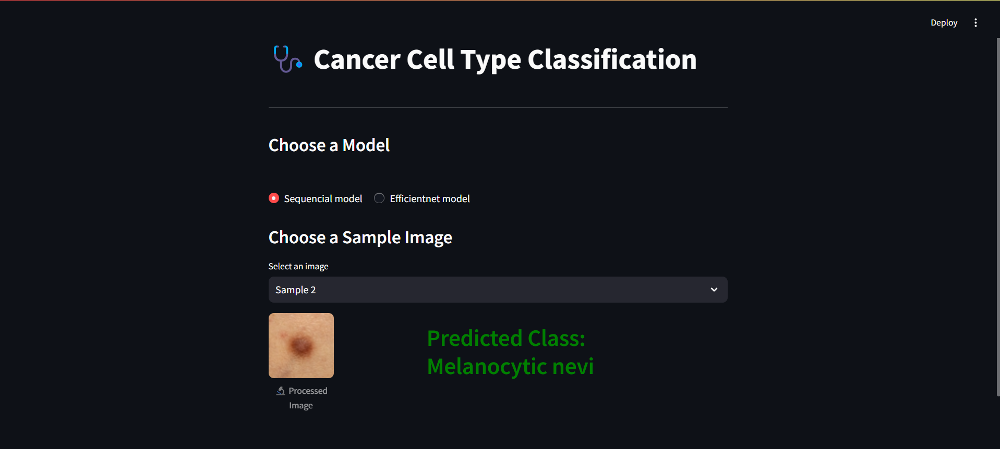

# 🩺 Skin Cancer Classification

## 📌 Overview
This project uses **deep learning models** to classify different types of skin cancer. It provides a **Streamlit web app** that allows users to upload an image and predict the type of skin lesion.

## 📷 Screenshot


## 🚀 Features
- **Multiple Deep Learning Models** (VGG16, EfficientNet, ResNet, MobileNet, etc.)
- **Streamlit Web App** for real-time predictions
- **Pre-trained Model Integration** for improved accuracy
- **Supports Image Upload & Preloaded Sample Images**

## 🔥 Models Used
1. **VGG16**
2. **EfficientNetB0**
3. **ResNet50**
4. **MobileNet**
5. **Custom CNN Model**

## 📂 Data Directory Structure
To ensure the training pipeline runs correctly, the dataset should be structured as follows:
```
data/
│── HAM10000_images_part_1/
│── HAM10000_images_part_2/
│── HAM10000_metadata.csv
│── hmnist_8_8_L.csv
│── hmnist_8_8_RGB.csv
│── hmnist_28_28_L.csv
│── hmnist_28_28_RGB.csv
│── processed_HAM10000_metadata.csv
```
Ensure all necessary files are placed in the correct folders before running the pipeline.

## 🛠 Installation
To set up the project locally, follow these steps:

### **1️⃣ Clone the Repository**
```bash
git clone https://github.com/Avadh-Ladani-0/Skin_Cancer_Classification.git
cd Skin_Cancer_Classification
```

### **2️⃣ Install Dependencies**
```bash
pip install -r requirements.txt
```

### **3️⃣ Run the Streamlit App**
```bash
streamlit run app.py
```

## 📊 Dataset
The project uses the **HAM10000 dataset**, a widely used dataset for skin cancer classification.

## 📌 Usage
1. **Select a Model** from the list.
2. **Upload an Image** or select from preloaded images.
3. **Get Predictions** in real-time with classification labels.

## 📜 License
This project is **open-source** under the MIT License.

## 🙌 Acknowledgments
- [HAM10000 Dataset](https://www.kaggle.com/datasets/kmader/skin-cancer-mnist-ham10000)
- TensorFlow & Keras for Deep Learning Models

---

📢 **For any issues or suggestions, feel free to raise an issue or contribute to the repo!**
